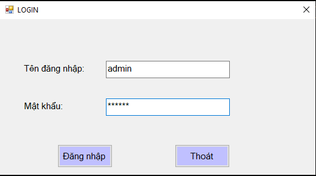

# Mô tả ứng dụng Quản lý thư viện

## Sử dụng SQL server để xây dựng database cho phần mềm

## Giao diện đăng nhập

### Sau khi đăng nhập thành công với tên đăng nhập là "admin", mật khẩu là "123456", giao diện đăng nhập sẽ chuyển sang giao diện chính của phần mềm

## Giao diện chính

### Ở góc phải giao diện chính là các button có chức năng như thêm, xóa, chỉnh sữa, tìm kiếm thông tin của sách. Button "Quản lý mượn trả" sẽ đưa giao diện chính sang giao diện Quản lý mượn trả. Button "Kết thúc" để đóng ứng dụng hoàn toàn.
### Ở giữa gồm 2 phần khung. Khung "Thông tin chi tiết" có chức năng nhận thông tin nhập vào từ bàn phím, sau đó sẽ trả thông tin cho các button xử lý như Thêm, xóa, chỉnh sữa, tìm kiếm thực hiện các chức năng tương ứng lên database và trả kết quả về cho khung "Danh sách".
### Sau khi điền đủ các thông tin hợp lệ vào toàn bộ textbox

### Thực hiện chức năng "Thêm", ta được kết quả:

### Ta có thể thay đổi thông tin sách đã nhập, bằng chức năng "Chỉnh sữa", bằng cách điền đúng tên mã sách ta cần chỉnh sửa và các thông tin ta muốn sửa lại

### Sau khi ấn button "Chỉnh sữa", kết quả đạt được

### Để xóa sách, ta chỉ cần click vào đầu dòng của loại sách ta cần muốn và thực hiện button "Xóa Sách"

### Đối với chức năng "Tìm kiếm" thì ta sẽ thực hiện tìm kiếm theo ký tự mà ta đã nhập ở textbox "Tên sách"

### Ở góc trái màn hình là thao tác nhanh để ta lọc và xem những loại sách có trong thư viện, và chi tiết từng cuốn sách thuộc loại sách đó:

### Sau khi ấn button "Quản lý mượn trả" ta sẽ được chuyển qua giao diện thứ 2 của phần mềm

## Giao diện "Mượn Trả"

### Cũng như giao diện chính, ở giao diện này cũng có các chức năng tương tự như thêm, xóa, sữa, tìm kiếm thông tin. Ngoài ra, ở đây còn có thêm chức năng xuất thông tin ra file excel. Chức năng này sẽ đưa toàn bộ những gì hiển thị trên "Danh sách người mượn" ra ngoài file excel một cách tự động

### Đối với button "Thoát" ở giao diện này thì nó sẽ đưa ta quay lại giao diện chính.

# End.
